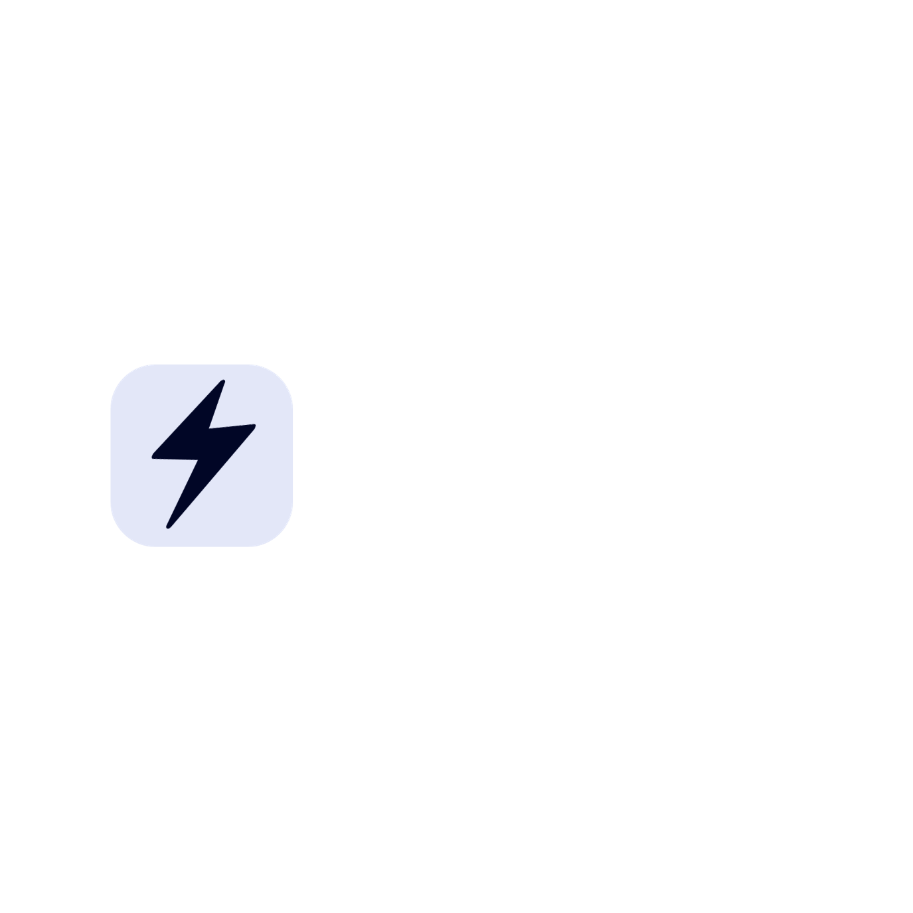
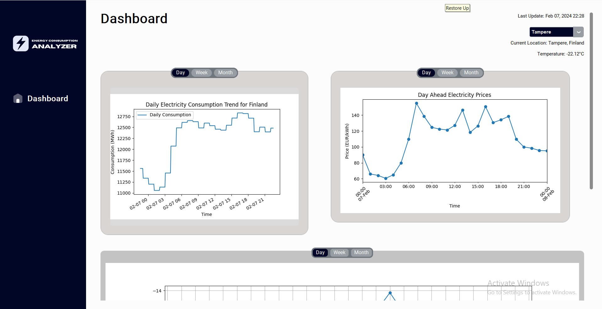

# Energy Consumption Analyzer (ECA)
<h1 align="center">

</h1>

## About
The Energy Consumption Analyzer is an MVC desktop application built in Python, designed to help users track and analyze electricity consumption data in Finland. It integrates multiple APIs to provide insights into energy usage patterns, correlating them with weather conditions. This is the group assignment for the Software Design course for Tampere Univerity and included 4 Team members including: Junaid Sadiq, Mubashir Saeed, Apanishile Johnson and Arslan Shahab
 

## Key Features
- Real-time weather data integration through the OpenWeatherMap API.
- Electricity consumption and pricing data analysis via Fingrid API and ENTSO-E API.
- Dynamic data visualization with matplotlib.

## Getting Started

### Prerequisites
- Ensure you have **Python v3.9** or higher installed on your system.

**STARTING APPLICATION INSTRUCTIONS**

- [ ] Make sure you have python v3.9 or higher installed
- [ ] clone this repo using: [https://github.com/Junaid-sadiq/Energy-Consumption-Analyzer-.git]
- [ ] Move to the approciate directory: cd<your_dir_folder>
- [ ] package required to run application:
- [ ] tkinter, customtkinter, pillow, matplotlib, requests,python_dotenv, entsoe-py
- [x] To install the necessary dependencies/pacakges run the following command in the terminal:
- [ ] pip install -r requirements.txt
- [ ] Once the requirements have been installed, run "python .\energy_consumption_analyzer.py" inside the project folder using windows Command 

